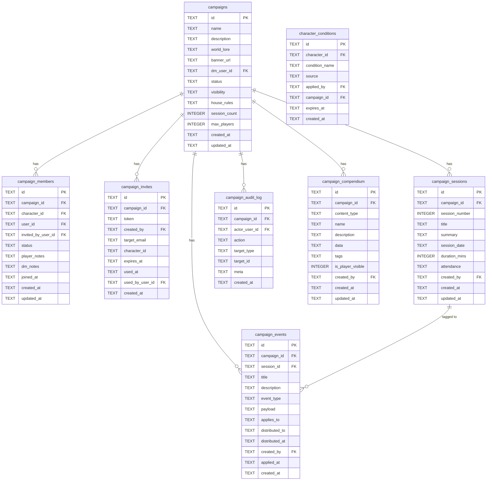
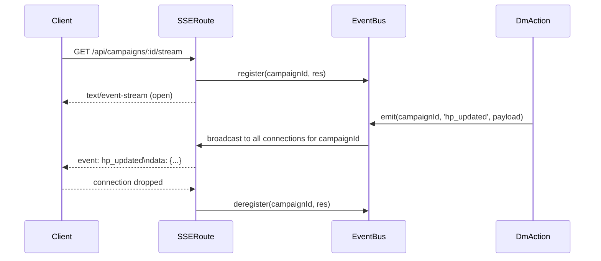
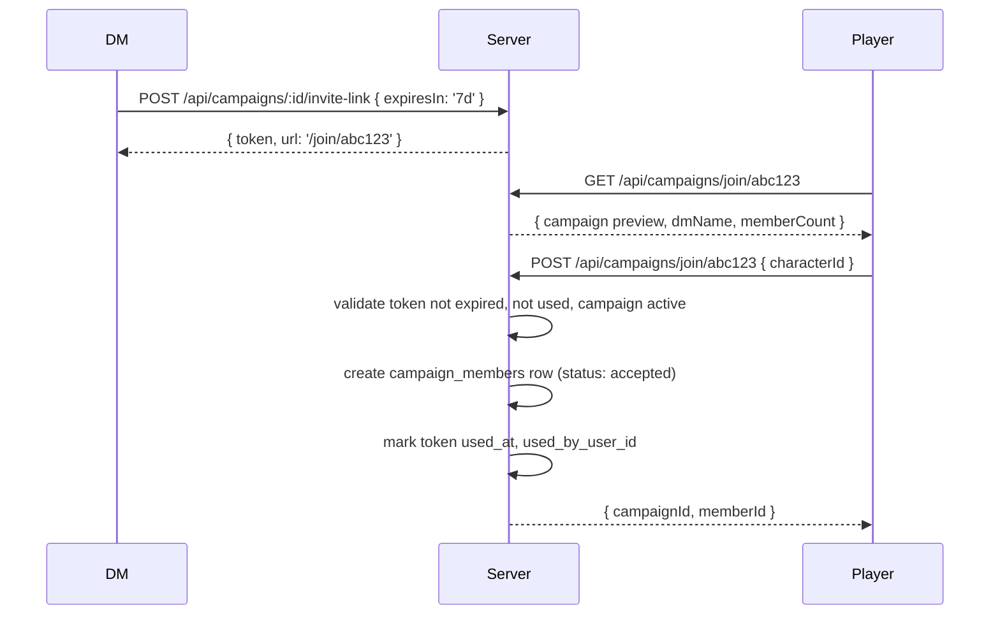

# Campaign Manager — Design

## Overview

The Campaign Manager is built entirely on top of the existing app architecture. It adds 7 database tables, a new repository module, a new route file, 10 frontend JS modules, and an SSE streaming endpoint. No existing tables are modified. No new npm dependencies are required.

---

## Architecture

### Layer map

```
Browser (Vanilla JS modules)
  └── campaign-dashboard.js        main view controller
  └── campaign-members.js          members tab + DM card controls
  └── campaign-sessions.js         sessions tab
  └── campaign-events.js           events tab + loot chest
  └── campaign-compendium-tab.js   DM compendium editor tab
  └── campaign-dm-sheet.js         DM-mode sheet overlay
  └── campaign-initiative.js       initiative tracker panel
  └── campaign-hp-grid.js          HP grid panel
  └── campaign-conditions.js       condition tracker logic
  └── campaign-invites.js          invite notifications + join flow
  └── campaign-stream.js           SSE client listener

Express App (app/app.js)
  └── /api/campaigns               app/routes/campaigns.js
  └── /api/campaigns/:id/stream    app/routes/campaignStream.js

Middleware
  └── app/middleware/campaignAccess.js

Repository
  └── app/data/campaignRepository.js

Database (SQLite / Azure SQL / MongoDB)
  └── 7 new tables / collections
```

---

### Database schema



> **Note:** `character_conditions` is a cross-cutting table; it references both `characters` and `campaigns`. It is created in migration `027_character_conditions.ts`.

---

### Migration files

```
scripts/migrations/
  020_campaigns.ts
  021_campaign_members.ts
  022_campaign_invites.ts
  023_campaign_sessions.ts
  024_campaign_events.ts
  025_campaign_audit_log.ts
  026_campaign_compendium.ts
  027_character_conditions.ts
```

Each file exports `up(db)` and `down(db)`. All 8 migrations run in order during `npm run db:refresh`.

---

### API route map

```mermaid
graph LR
    A[/api/campaigns] --> B[POST - create]
    A --> C[GET - list own + joined]
    A --> D[GET /public - browse]
    A --> E[GET /:id - detail]
    A --> F[PATCH /:id - update]
    A --> G[DELETE /:id - delete]
    A --> H[POST /:id/archive]
    A --> I[POST /:id/transfer]

    A --> J[POST /:id/invite]
    A --> K[POST /:id/invite-link]
    A --> L[GET /:id/members]
    A --> M[PATCH /:id/members/:mId]
    A --> N[PATCH /:id/members/:mId/notes]
    A --> O[DELETE /:id/members/:mId]
    A --> P[GET /invites/pending]
    A --> Q[POST /join/:token]

    A --> R[GET /:id/characters/:cId - DM sheet]
    A --> S[PATCH /:id/characters/:cId - DM edit]
    A --> T[POST /:id/characters/:cId/award-xp]
    A --> U[POST /:id/characters/:cId/apply-damage]
    A --> V[POST /:id/characters/:cId/apply-healing]
    A --> W[POST /:id/characters/:cId/grant-item]
    A --> X[POST /:id/characters/:cId/apply-condition]
    A --> Y[DELETE /:id/characters/:cId/conditions/:cond]
    A --> Z[POST /:id/bulk-action]

    A --> AA[POST /:id/sessions]
    A --> AB[GET /:id/sessions]
    A --> AC[PATCH /:id/sessions/:sId]
    A --> AD[POST /:id/sessions/:sId/attendance]

    A --> AE[POST /:id/events]
    A --> AF[GET /:id/events]
    A --> AG[POST /:id/events/:eId/apply]

    A --> AH[GET /:id/compendium]
    A --> AI[GET /:id/compendium/:eId]
    A --> AJ[POST /:id/compendium]
    A --> AK[PATCH /:id/compendium/:eId]
    A --> AL[DELETE /:id/compendium/:eId]
    A --> AM[POST /:id/compendium/:eId/grant]

    A --> AN[GET /:id/houserules]
    A --> AO[PUT /:id/houserules]
    A --> AP[GET /:id/audit]

    SSE[/api/campaigns/:id/stream] --> AQ[GET - SSE connection]
```

---

### Access control middleware

Three middleware functions in `app/middleware/campaignAccess.js`:

```
requireDM
  → verifies req.user is campaigns.dm_user_id OR role is admin
  → attaches req.campaign

requireCampaignMember
  → verifies req.user has an accepted campaign_members row OR is DM/admin
  → attaches req.campaign and req.campaignMember

requireCampaignCharacterAccess
  → verifies the character_id in req.params belongs to this campaign
  → verifies req.user is the character owner, DM, or admin
  → attaches req.campaign, req.campaignMember, req.campaignCharacter
```

All three load the campaign row on first call and cache it on `req.campaign` to avoid duplicate DB queries in the same request.

---

### SSE architecture



The `EventBus` is a module-level `Map<campaignId, Set<SSEConnection>>` in `app/services/campaignEventBus.js`. It is imported by both the SSE route and by any route handler that needs to broadcast.

SSE event types:

| Event | Payload |
|---|---|
| `hp_updated` | `{ characterId, currentHp, maxHp }` |
| `condition_applied` | `{ characterId, condition, source }` |
| `condition_removed` | `{ characterId, condition }` |
| `initiative_updated` | `{ order: [{ characterId, name, initiative, currentHp }] }` |
| `turn_advanced` | `{ currentCharacterId, round }` |
| `dice_roll_broadcast` | `{ characterId, formula, result, total }` |
| `dm_broadcast` | `{ message, severity }` |
| `loot_updated` | `{ eventId, action, item }` |
| `session_started` | `{ sessionId, dmName }` |
| `session_ended` | `{ sessionId }` |
| `member_joined` | `{ characterId, characterName }` |
| `catch_up` | `{ hpGrid: [...], conditions: [...], initiativeOrder: [...] }` |

---

### Compendium window integration

The existing `compendium.js` module is extended:

1. If `activeCampaignId` is set (stored in app state), inject a `GET /api/campaigns/:id/compendium?search=` call alongside the existing SRD search.
2. Merge results, tagging campaign entries with `{ _source: 'campaign', _campaignId }`.
3. Render campaign entries with a coloured left border and a campaign badge icon.
4. DM-only entries (`is_player_visible = 0`) rendered with a lock icon; absent for players.
5. Add an **Add to Campaign** button on SRD entry detail panes (visible to DM only) that POSTs to `/api/campaigns/:id/compendium` with the SRD data as initial payload.
6. All existing drag-drop, routing, and detail pane logic works unchanged for campaign entries.

---

### DM sheet mode

The existing character sheet (`sheet.js`) is extended with two new entry points:

- `sheet.openAsDM(characterId, campaignId)` — loads the sheet in DM mode
- `sheet.openAsPlayer(characterId)` — existing behaviour, unchanged

DM mode differences from player mode:

- A fixed amber banner is injected above the tab bar: `"DM View — {character} (owned by {player})"`.
- All inputs are `disabled` by default.
- An **Enable Edit Mode** toggle is rendered in the banner. On enable: remove `disabled` from all inputs and swap the save handler to `PATCH /api/campaigns/:campaignId/characters/:characterId`.
- A right-docked DM sidebar is injected. It contains: DM Notes textarea, Conditions panel, Quick Actions panel, Event History list.
- The DM sidebar is never rendered when `sheet.openAsPlayer` is called.

---

### Frontend module responsibilities

| Module | Responsibility |
|---|---|
| `campaign-dashboard.js` | Campaign list sidebar, detail view tab router, create campaign wizard |
| `campaign-members.js` | Member card grid, DM per-card actions, open sheet in DM mode |
| `campaign-sessions.js` | Session list, log new session form |
| `campaign-events.js` | Event timeline, log event form, loot chest view |
| `campaign-compendium-tab.js` | Compendium CRUD tab inside campaign dashboard |
| `campaign-dm-sheet.js` | DM banner injection, edit mode toggle, DM sidebar |
| `campaign-initiative.js` | Initiative tracker floating panel |
| `campaign-hp-grid.js` | HP grid panel, inline damage/healing controls |
| `campaign-conditions.js` | Condition add/remove logic, pill rendering |
| `campaign-invites.js` | Pending invite badge, invite card UI, accept/decline, join-via-token |
| `campaign-stream.js` | SSE connect/disconnect, event dispatch to other modules |

---

### Invite token flow



---

### Testing strategy

- **Unit tests** (`tests/unit/`): repository methods against in-memory SQLite, middleware logic, token generation/validation, XP threshold calculation, event apply side-effects.
- **Integration tests** (`tests/integration/`): full lifecycle via supertest — create campaign → invite → accept → DM edits sheet → audit log verified → apply event → distribute loot → archive campaign.
- **SSE tests**: use `EventSource` mock to verify events are received after HP update and condition change.
- All tests run with `npm test`. Campaign integration tests also run as `npm run test:campaign`.
