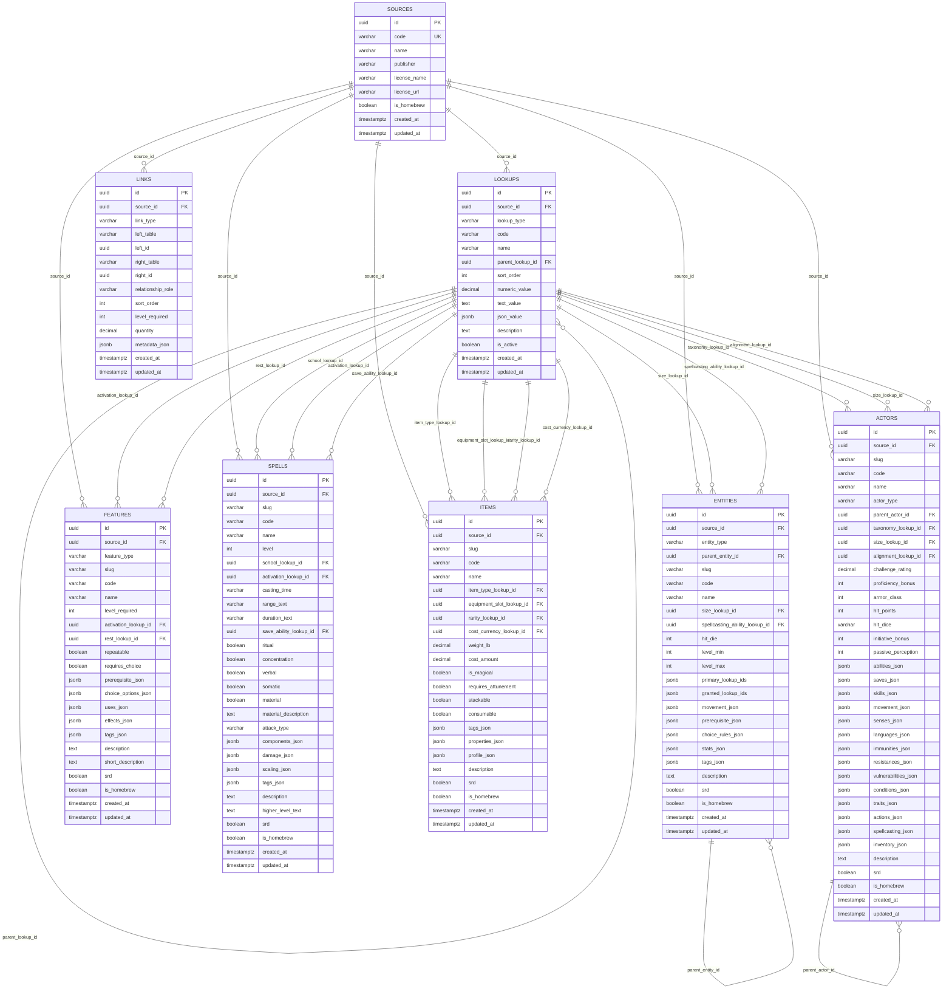

# Current SQLite ERD

This ERD reflects the normalized schema currently present in `data/5e-database.sqlite`.

Notes:
- The database now contains 8 tables: `sources`, `lookups`, `entities`, `features`, `spells`, `items`, `actors`, and `links`.
- The `links` table is polymorphic. Its `left_id` and `right_id` columns intentionally do not use SQL foreign keys because they can point at multiple domain tables.
- The requested conceptual shape was kept, but some unique indexes are source-scoped in the actual SQLite schema because the SRD data contains real duplicate names across 2014 and 2024.

