# Current SQLite ERD

This ERD reflects the physical schema currently present in `data/5e-database.sqlite`.

Notes:
- The database currently contains 44 tables.
- Every table has the same physical shape: `index` as the primary key, `document` as the stored JSON payload, and `updated_at` as the last refresh timestamp.
- There are no foreign key constraints in the current schema.
- The `2014-collections` and `2024-collections` relationships shown below are metadata relationships, not database-enforced foreign keys. They indicate which collection tables exist for each ruleset.
- Most game-domain relationships are embedded inside the JSON stored in `document`, so they do not appear as normalized SQL relationships in the ERD.

```mermaid
erDiagram
    T_2014_ABILITY_SCORES {
        TEXT index PK
        TEXT document
        TEXT updated_at
    }
    T_2014_ALIGNMENTS {
        TEXT index PK
        TEXT document
        TEXT updated_at
    }
    T_2014_BACKGROUNDS {
        TEXT index PK
        TEXT document
        TEXT updated_at
    }
    T_2014_CLASSES {
        TEXT index PK
        TEXT document
        TEXT updated_at
    }
    T_2014_COLLECTIONS {
        TEXT index PK
        TEXT document
        TEXT updated_at
    }
    T_2014_CONDITIONS {
        TEXT index PK
        TEXT document
        TEXT updated_at
    }
    T_2014_DAMAGE_TYPES {
        TEXT index PK
        TEXT document
        TEXT updated_at
    }
    T_2014_EQUIPMENT {
        TEXT index PK
        TEXT document
        TEXT updated_at
    }
    T_2014_EQUIPMENT_CATEGORIES {
        TEXT index PK
        TEXT document
        TEXT updated_at
    }
    T_2014_FEATS {
        TEXT index PK
        TEXT document
        TEXT updated_at
    }
    T_2014_FEATURES {
        TEXT index PK
        TEXT document
        TEXT updated_at
    }
    T_2014_LANGUAGES {
        TEXT index PK
        TEXT document
        TEXT updated_at
    }
    T_2014_LEVELS {
        TEXT index PK
        TEXT document
        TEXT updated_at
    }
    T_2014_MAGIC_ITEMS {
        TEXT index PK
        TEXT document
        TEXT updated_at
    }
    T_2014_MAGIC_SCHOOLS {
        TEXT index PK
        TEXT document
        TEXT updated_at
    }
    T_2014_MONSTERS {
        TEXT index PK
        TEXT document
        TEXT updated_at
    }
    T_2014_PROFICIENCIES {
        TEXT index PK
        TEXT document
        TEXT updated_at
    }
    T_2014_RACES {
        TEXT index PK
        TEXT document
        TEXT updated_at
    }
    T_2014_RULE_SECTIONS {
        TEXT index PK
        TEXT document
        TEXT updated_at
    }
    T_2014_RULES {
        TEXT index PK
        TEXT document
        TEXT updated_at
    }
    T_2014_SKILLS {
        TEXT index PK
        TEXT document
        TEXT updated_at
    }
    T_2014_SPELLS {
        TEXT index PK
        TEXT document
        TEXT updated_at
    }
    T_2014_SUBCLASSES {
        TEXT index PK
        TEXT document
        TEXT updated_at
    }
    T_2014_SUBRACES {
        TEXT index PK
        TEXT document
        TEXT updated_at
    }
    T_2014_TRAITS {
        TEXT index PK
        TEXT document
        TEXT updated_at
    }
    T_2014_WEAPON_PROPERTIES {
        TEXT index PK
        TEXT document
        TEXT updated_at
    }
    T_2024_ABILITY_SCORES {
        TEXT index PK
        TEXT document
        TEXT updated_at
    }
    T_2024_ALIGNMENTS {
        TEXT index PK
        TEXT document
        TEXT updated_at
    }
    T_2024_BACKGROUNDS {
        TEXT index PK
        TEXT document
        TEXT updated_at
    }
    T_2024_COLLECTIONS {
        TEXT index PK
        TEXT document
        TEXT updated_at
    }
    T_2024_CONDITIONS {
        TEXT index PK
        TEXT document
        TEXT updated_at
    }
    T_2024_DAMAGE_TYPES {
        TEXT index PK
        TEXT document
        TEXT updated_at
    }
    T_2024_EQUIPMENT {
        TEXT index PK
        TEXT document
        TEXT updated_at
    }
    T_2024_EQUIPMENT_CATEGORIES {
        TEXT index PK
        TEXT document
        TEXT updated_at
    }
    T_2024_FEATS {
        TEXT index PK
        TEXT document
        TEXT updated_at
    }
    T_2024_LANGUAGES {
        TEXT index PK
        TEXT document
        TEXT updated_at
    }
    T_2024_MAGIC_SCHOOLS {
        TEXT index PK
        TEXT document
        TEXT updated_at
    }
    T_2024_PROFICIENCIES {
        TEXT index PK
        TEXT document
        TEXT updated_at
    }
    T_2024_SKILLS {
        TEXT index PK
        TEXT document
        TEXT updated_at
    }
    T_2024_SPECIES {
        TEXT index PK
        TEXT document
        TEXT updated_at
    }
    T_2024_SUBSPECIES {
        TEXT index PK
        TEXT document
        TEXT updated_at
    }
    T_2024_TRAITS {
        TEXT index PK
        TEXT document
        TEXT updated_at
    }
    T_2024_WEAPON_MASTERY_PROPERTIES {
        TEXT index PK
        TEXT document
        TEXT updated_at
    }
    T_2024_WEAPON_PROPERTIES {
        TEXT index PK
        TEXT document
        TEXT updated_at
    }

    T_2014_COLLECTIONS ||--o{ T_2014_ABILITY_SCORES : catalogs
    T_2014_COLLECTIONS ||--o{ T_2014_ALIGNMENTS : catalogs
    T_2014_COLLECTIONS ||--o{ T_2014_BACKGROUNDS : catalogs
    T_2014_COLLECTIONS ||--o{ T_2014_CLASSES : catalogs
    T_2014_COLLECTIONS ||--o{ T_2014_CONDITIONS : catalogs
    T_2014_COLLECTIONS ||--o{ T_2014_DAMAGE_TYPES : catalogs
    T_2014_COLLECTIONS ||--o{ T_2014_EQUIPMENT : catalogs
    T_2014_COLLECTIONS ||--o{ T_2014_EQUIPMENT_CATEGORIES : catalogs
    T_2014_COLLECTIONS ||--o{ T_2014_FEATS : catalogs
    T_2014_COLLECTIONS ||--o{ T_2014_FEATURES : catalogs
    T_2014_COLLECTIONS ||--o{ T_2014_LANGUAGES : catalogs
    T_2014_COLLECTIONS ||--o{ T_2014_LEVELS : catalogs
    T_2014_COLLECTIONS ||--o{ T_2014_MAGIC_ITEMS : catalogs
    T_2014_COLLECTIONS ||--o{ T_2014_MAGIC_SCHOOLS : catalogs
    T_2014_COLLECTIONS ||--o{ T_2014_MONSTERS : catalogs
    T_2014_COLLECTIONS ||--o{ T_2014_PROFICIENCIES : catalogs
    T_2014_COLLECTIONS ||--o{ T_2014_RACES : catalogs
    T_2014_COLLECTIONS ||--o{ T_2014_RULE_SECTIONS : catalogs
    T_2014_COLLECTIONS ||--o{ T_2014_RULES : catalogs
    T_2014_COLLECTIONS ||--o{ T_2014_SKILLS : catalogs
    T_2014_COLLECTIONS ||--o{ T_2014_SPELLS : catalogs
    T_2014_COLLECTIONS ||--o{ T_2014_SUBCLASSES : catalogs
    T_2014_COLLECTIONS ||--o{ T_2014_SUBRACES : catalogs
    T_2014_COLLECTIONS ||--o{ T_2014_TRAITS : catalogs
    T_2014_COLLECTIONS ||--o{ T_2014_WEAPON_PROPERTIES : catalogs
    T_2024_COLLECTIONS ||--o{ T_2024_ABILITY_SCORES : catalogs
    T_2024_COLLECTIONS ||--o{ T_2024_ALIGNMENTS : catalogs
    T_2024_COLLECTIONS ||--o{ T_2024_BACKGROUNDS : catalogs
    T_2024_COLLECTIONS ||--o{ T_2024_CONDITIONS : catalogs
    T_2024_COLLECTIONS ||--o{ T_2024_DAMAGE_TYPES : catalogs
    T_2024_COLLECTIONS ||--o{ T_2024_EQUIPMENT : catalogs
    T_2024_COLLECTIONS ||--o{ T_2024_EQUIPMENT_CATEGORIES : catalogs
    T_2024_COLLECTIONS ||--o{ T_2024_FEATS : catalogs
    T_2024_COLLECTIONS ||--o{ T_2024_LANGUAGES : catalogs
    T_2024_COLLECTIONS ||--o{ T_2024_MAGIC_SCHOOLS : catalogs
    T_2024_COLLECTIONS ||--o{ T_2024_PROFICIENCIES : catalogs
    T_2024_COLLECTIONS ||--o{ T_2024_SKILLS : catalogs
    T_2024_COLLECTIONS ||--o{ T_2024_SPECIES : catalogs
    T_2024_COLLECTIONS ||--o{ T_2024_SUBSPECIES : catalogs
    T_2024_COLLECTIONS ||--o{ T_2024_TRAITS : catalogs
    T_2024_COLLECTIONS ||--o{ T_2024_WEAPON_MASTERY_PROPERTIES : catalogs
    T_2024_COLLECTIONS ||--o{ T_2024_WEAPON_PROPERTIES : catalogs
```

## Entity Mapping

- `T_2014_ABILITY_SCORES` = `2014-ability-scores`
- `T_2014_ALIGNMENTS` = `2014-alignments`
- `T_2014_BACKGROUNDS` = `2014-backgrounds`
- `T_2014_CLASSES` = `2014-classes`
- `T_2014_COLLECTIONS` = `2014-collections`
- `T_2014_CONDITIONS` = `2014-conditions`
- `T_2014_DAMAGE_TYPES` = `2014-damage-types`
- `T_2014_EQUIPMENT` = `2014-equipment`
- `T_2014_EQUIPMENT_CATEGORIES` = `2014-equipment-categories`
- `T_2014_FEATS` = `2014-feats`
- `T_2014_FEATURES` = `2014-features`
- `T_2014_LANGUAGES` = `2014-languages`
- `T_2014_LEVELS` = `2014-levels`
- `T_2014_MAGIC_ITEMS` = `2014-magic-items`
- `T_2014_MAGIC_SCHOOLS` = `2014-magic-schools`
- `T_2014_MONSTERS` = `2014-monsters`
- `T_2014_PROFICIENCIES` = `2014-proficiencies`
- `T_2014_RACES` = `2014-races`
- `T_2014_RULE_SECTIONS` = `2014-rule-sections`
- `T_2014_RULES` = `2014-rules`
- `T_2014_SKILLS` = `2014-skills`
- `T_2014_SPELLS` = `2014-spells`
- `T_2014_SUBCLASSES` = `2014-subclasses`
- `T_2014_SUBRACES` = `2014-subraces`
- `T_2014_TRAITS` = `2014-traits`
- `T_2014_WEAPON_PROPERTIES` = `2014-weapon-properties`
- `T_2024_ABILITY_SCORES` = `2024-ability-scores`
- `T_2024_ALIGNMENTS` = `2024-alignments`
- `T_2024_BACKGROUNDS` = `2024-backgrounds`
- `T_2024_COLLECTIONS` = `2024-collections`
- `T_2024_CONDITIONS` = `2024-conditions`
- `T_2024_DAMAGE_TYPES` = `2024-damage-types`
- `T_2024_EQUIPMENT` = `2024-equipment`
- `T_2024_EQUIPMENT_CATEGORIES` = `2024-equipment-categories`
- `T_2024_FEATS` = `2024-feats`
- `T_2024_LANGUAGES` = `2024-languages`
- `T_2024_MAGIC_SCHOOLS` = `2024-magic-schools`
- `T_2024_PROFICIENCIES` = `2024-proficiencies`
- `T_2024_SKILLS` = `2024-skills`
- `T_2024_SPECIES` = `2024-species`
- `T_2024_SUBSPECIES` = `2024-subspecies`
- `T_2024_TRAITS` = `2024-traits`
- `T_2024_WEAPON_MASTERY_PROPERTIES` = `2024-weapon-mastery-properties`
- `T_2024_WEAPON_PROPERTIES` = `2024-weapon-properties`
