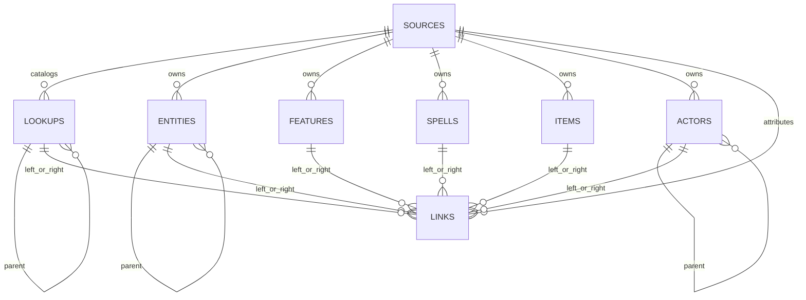

# Logical ERD

The current SQLite schema is already a practical logical model. The main abstraction is the `links` table, which carries cross-table relationships between normalized records.

Common seeded relationship patterns:
- `entity_feature`: class, subclass, ancestry, and background grants
- `entity_spell`: class and subclass spell access
- `item_lookup`: item categories, properties, rarity, and damage types
- `actor_spell`: monster spellcasting
- `actor_lookup`: monster proficiencies, immunities, resistances, and vulnerabilities
- `lookup_item` and `lookup_lookup`: category membership and rule/lookup hierarchies

