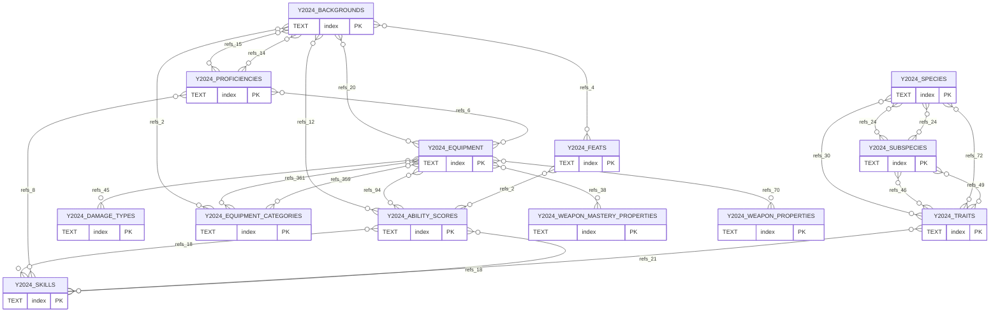

# Logical ERD

This is a logical ERD inferred from the JSON documents, not from SQL foreign keys.

How it was derived:
- Each entity is a collection keyed by `index`.
- Relationships were inferred from embedded `/api/<year>/<collection>/<id>` references found inside the JSON payloads.
- Self-references were omitted to keep the diagrams readable.
- Every edge is shown as a generic many-to-many logical reference. The actual runtime cardinality varies by field.
- Edge labels use `refs_<n>` where `<n>` is the number of embedded references found from the source collection to the target collection.

## 2014

```mermaid
erDiagram
    Y2014_ABILITY_SCORES {
        TEXT index PK
    }
    Y2014_ALIGNMENTS {
        TEXT index PK
    }
    Y2014_BACKGROUNDS {
        TEXT index PK
    }
    Y2014_CLASSES {
        TEXT index PK
    }
    Y2014_CONDITIONS {
        TEXT index PK
    }
    Y2014_DAMAGE_TYPES {
        TEXT index PK
    }
    Y2014_EQUIPMENT {
        TEXT index PK
    }
    Y2014_EQUIPMENT_CATEGORIES {
        TEXT index PK
    }
    Y2014_FEATS {
        TEXT index PK
    }
    Y2014_FEATURES {
        TEXT index PK
    }
    Y2014_LANGUAGES {
        TEXT index PK
    }
    Y2014_LEVELS {
        TEXT index PK
    }
    Y2014_MAGIC_ITEMS {
        TEXT index PK
    }
    Y2014_MAGIC_SCHOOLS {
        TEXT index PK
    }
    Y2014_MONSTERS {
        TEXT index PK
    }
    Y2014_PROFICIENCIES {
        TEXT index PK
    }
    Y2014_RACES {
        TEXT index PK
    }
    Y2014_RULE_SECTIONS {
        TEXT index PK
    }
    Y2014_RULES {
        TEXT index PK
    }
    Y2014_SKILLS {
        TEXT index PK
    }
    Y2014_SPELLS {
        TEXT index PK
    }
    Y2014_SUBCLASSES {
        TEXT index PK
    }
    Y2014_SUBRACES {
        TEXT index PK
    }
    Y2014_TRAITS {
        TEXT index PK
    }
    Y2014_WEAPON_PROPERTIES {
        TEXT index PK
    }

    Y2014_ABILITY_SCORES }o--o{ Y2014_SKILLS : refs_18
    Y2014_BACKGROUNDS }o--o{ Y2014_ALIGNMENTS : refs_24
    Y2014_BACKGROUNDS }o--o{ Y2014_EQUIPMENT : refs_2
    Y2014_BACKGROUNDS }o--o{ Y2014_EQUIPMENT_CATEGORIES : refs_1
    Y2014_BACKGROUNDS }o--o{ Y2014_PROFICIENCIES : refs_2
    Y2014_CLASSES }o--o{ Y2014_ABILITY_SCORES : refs_48
    Y2014_CLASSES }o--o{ Y2014_EQUIPMENT : refs_81
    Y2014_CLASSES }o--o{ Y2014_EQUIPMENT_CATEGORIES : refs_23
    Y2014_CLASSES }o--o{ Y2014_PROFICIENCIES : refs_301
    Y2014_CLASSES }o--o{ Y2014_SUBCLASSES : refs_12
    Y2014_EQUIPMENT }o--o{ Y2014_DAMAGE_TYPES : refs_42
    Y2014_EQUIPMENT }o--o{ Y2014_EQUIPMENT_CATEGORIES : refs_353
    Y2014_EQUIPMENT }o--o{ Y2014_WEAPON_PROPERTIES : refs_75
    Y2014_EQUIPMENT_CATEGORIES }o--o{ Y2014_EQUIPMENT : refs_582
    Y2014_EQUIPMENT_CATEGORIES }o--o{ Y2014_MAGIC_ITEMS : refs_362
    Y2014_FEATS }o--o{ Y2014_ABILITY_SCORES : refs_1
    Y2014_FEATURES }o--o{ Y2014_CLASSES : refs_407
    Y2014_FEATURES }o--o{ Y2014_PROFICIENCIES : refs_92
    Y2014_FEATURES }o--o{ Y2014_SUBCLASSES : refs_88
    Y2014_LEVELS }o--o{ Y2014_CLASSES : refs_530
    Y2014_LEVELS }o--o{ Y2014_FEATURES : refs_317
    Y2014_LEVELS }o--o{ Y2014_SUBCLASSES : refs_100
    Y2014_MAGIC_ITEMS }o--o{ Y2014_EQUIPMENT_CATEGORIES : refs_362
    Y2014_MONSTERS }o--o{ Y2014_ABILITY_SCORES : refs_210
    Y2014_MONSTERS }o--o{ Y2014_CONDITIONS : refs_340
    Y2014_MONSTERS }o--o{ Y2014_DAMAGE_TYPES : refs_709
    Y2014_MONSTERS }o--o{ Y2014_EQUIPMENT : refs_41
    Y2014_MONSTERS }o--o{ Y2014_PROFICIENCIES : refs_714
    Y2014_MONSTERS }o--o{ Y2014_SPELLS : refs_317
    Y2014_PROFICIENCIES }o--o{ Y2014_ABILITY_SCORES : refs_6
    Y2014_PROFICIENCIES }o--o{ Y2014_CLASSES : refs_87
    Y2014_PROFICIENCIES }o--o{ Y2014_EQUIPMENT : refs_85
    Y2014_PROFICIENCIES }o--o{ Y2014_EQUIPMENT_CATEGORIES : refs_8
    Y2014_PROFICIENCIES }o--o{ Y2014_RACES : refs_5
    Y2014_PROFICIENCIES }o--o{ Y2014_SKILLS : refs_18
    Y2014_PROFICIENCIES }o--o{ Y2014_SUBRACES : refs_4
    Y2014_RACES }o--o{ Y2014_ABILITY_SCORES : refs_22
    Y2014_RACES }o--o{ Y2014_LANGUAGES : refs_46
    Y2014_RACES }o--o{ Y2014_SUBRACES : refs_4
    Y2014_RACES }o--o{ Y2014_TRAITS : refs_27
    Y2014_RULES }o--o{ Y2014_RULE_SECTIONS : refs_33
    Y2014_SKILLS }o--o{ Y2014_ABILITY_SCORES : refs_18
    Y2014_SPELLS }o--o{ Y2014_ABILITY_SCORES : refs_92
    Y2014_SPELLS }o--o{ Y2014_CLASSES : refs_778
    Y2014_SPELLS }o--o{ Y2014_DAMAGE_TYPES : refs_64
    Y2014_SPELLS }o--o{ Y2014_MAGIC_SCHOOLS : refs_319
    Y2014_SPELLS }o--o{ Y2014_SUBCLASSES : refs_232
    Y2014_SUBCLASSES }o--o{ Y2014_CLASSES : refs_97
    Y2014_SUBCLASSES }o--o{ Y2014_FEATURES : refs_56
    Y2014_SUBCLASSES }o--o{ Y2014_SPELLS : refs_85
    Y2014_SUBRACES }o--o{ Y2014_ABILITY_SCORES : refs_4
    Y2014_SUBRACES }o--o{ Y2014_RACES : refs_4
    Y2014_SUBRACES }o--o{ Y2014_TRAITS : refs_7
    Y2014_TRAITS }o--o{ Y2014_ABILITY_SCORES : refs_10
    Y2014_TRAITS }o--o{ Y2014_DAMAGE_TYPES : refs_20
    Y2014_TRAITS }o--o{ Y2014_LANGUAGES : refs_14
    Y2014_TRAITS }o--o{ Y2014_PROFICIENCIES : refs_32
    Y2014_TRAITS }o--o{ Y2014_RACES : refs_37
    Y2014_TRAITS }o--o{ Y2014_SPELLS : refs_14
    Y2014_TRAITS }o--o{ Y2014_SUBRACES : refs_7
```

## 2014 Entity Mapping

- `Y2014_ABILITY_SCORES` = `ability-scores`
- `Y2014_ALIGNMENTS` = `alignments`
- `Y2014_BACKGROUNDS` = `backgrounds`
- `Y2014_CLASSES` = `classes`
- `Y2014_CONDITIONS` = `conditions`
- `Y2014_DAMAGE_TYPES` = `damage-types`
- `Y2014_EQUIPMENT` = `equipment`
- `Y2014_EQUIPMENT_CATEGORIES` = `equipment-categories`
- `Y2014_FEATS` = `feats`
- `Y2014_FEATURES` = `features`
- `Y2014_LANGUAGES` = `languages`
- `Y2014_LEVELS` = `levels`
- `Y2014_MAGIC_ITEMS` = `magic-items`
- `Y2014_MAGIC_SCHOOLS` = `magic-schools`
- `Y2014_MONSTERS` = `monsters`
- `Y2014_PROFICIENCIES` = `proficiencies`
- `Y2014_RACES` = `races`
- `Y2014_RULE_SECTIONS` = `rule-sections`
- `Y2014_RULES` = `rules`
- `Y2014_SKILLS` = `skills`
- `Y2014_SPELLS` = `spells`
- `Y2014_SUBCLASSES` = `subclasses`
- `Y2014_SUBRACES` = `subraces`
- `Y2014_TRAITS` = `traits`
- `Y2014_WEAPON_PROPERTIES` = `weapon-properties`

## 2024

## 2024 Entity Mapping

- `Y2024_ABILITY_SCORES` = `ability-scores`
- `Y2024_BACKGROUNDS` = `backgrounds`
- `Y2024_DAMAGE_TYPES` = `damage-types`
- `Y2024_EQUIPMENT` = `equipment`
- `Y2024_EQUIPMENT_CATEGORIES` = `equipment-categories`
- `Y2024_FEATS` = `feats`
- `Y2024_PROFICIENCIES` = `proficiencies`
- `Y2024_SKILLS` = `skills`
- `Y2024_SPECIES` = `species`
- `Y2024_SUBSPECIES` = `subspecies`
- `Y2024_TRAITS` = `traits`
- `Y2024_WEAPON_MASTERY_PROPERTIES` = `weapon-mastery-properties`
- `Y2024_WEAPON_PROPERTIES` = `weapon-properties`

## Omitted Collections

These collections were omitted from the logical ERD because they only contained self-references or no cross-collection references:
- `2024-alignments`
- `2024-conditions`
- `2024-languages`
- `2024-magic-schools`
